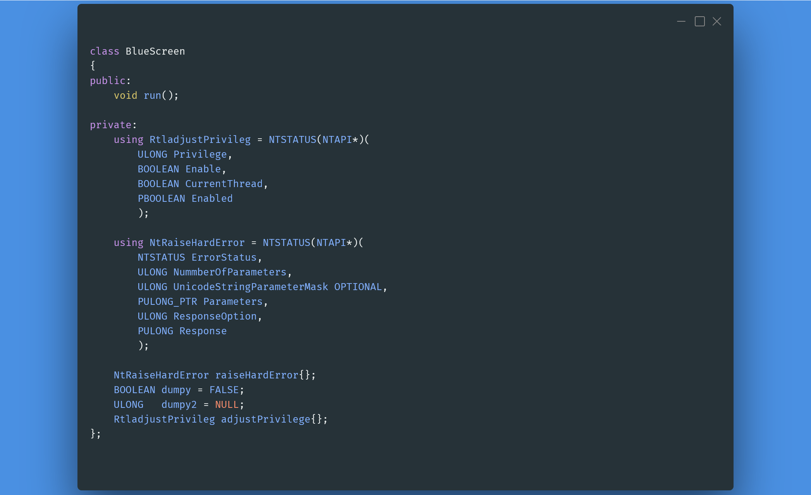
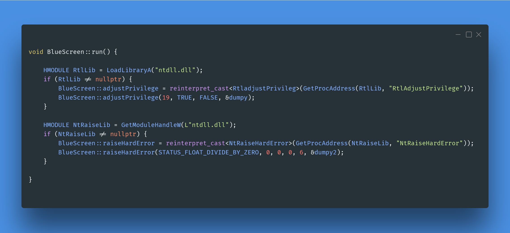

`WinBlueScreen` is a fun project.

The GUI program runs undocumented Windows DLLs, which causes a bluescreen

**get the program**
---

1. download
    - 

2. compile code and create an executable file
   1. ### requirement
      + Git for windows
      + CMake (GUI)
      + IDE (Visual studio)
   2. Git
      + open Powershell
      + `$ git.exe clone https://github.com/RussDev46/WinBlueScreen.git`
   3. CMake
      + Create folder (build)
      + open CMake gui
      + source code: `C:/YOUR PATH/WinBlueScreen`
      + build binaries: `C:/YOUR PATH/WinBlueScreen/build`
      + press the configure and generate buttons
   4. IDE
      + open in the folder build "sln" file (Visual studio)
  
**Bluescreen code**
---

#### [src/blueScreen.h](https://github.com/RussDev46/WinBlueScreen/blob/main/src/blueScreen.h)

#### [src/blueScreen.cpp](https://github.com/RussDev46/WinBlueScreen/blob/main/src/blueScreen.cpp)

